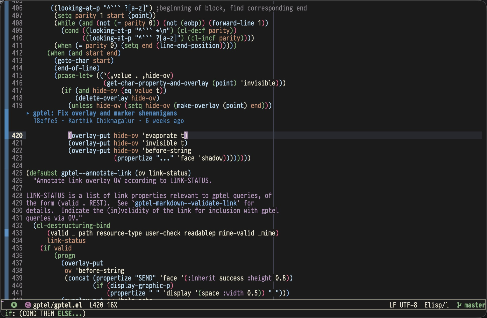
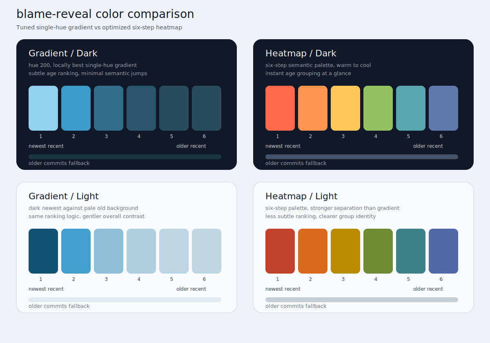

* blame-reveal.el

Contextual Git blame for Emacs with smart commit selection, recursive history navigation, and focus mode.

#+begin_quote
Show only what matters—recent commits in visible lines.
#+end_quote

** Core Features

*** Smart Rendering

Only renders the viewport with margins, ensuring instant activation and smooth scrolling on large files (10k+ lines). Fringe colors follow IntelliJ IDEA style: newest commits are brightest.

*** Three Header Styles

- =block= — Header above the first line of each commit block
- =inline= — Compact header after the first line
- =margin= — In left/right window margin (minimal intrusion)

*** Time-Based Commit Selection

=blame-reveal-recent-days-limit= controls which commits get colored:

| Value   | Behavior                                              |
|---------+-------------------------------------------------------|
| ='auto= | Adapts to commit density for optimal gradient quality |
| number  | Fixed days (30, 90, 180, 365, etc.)                   |
| =nil=   | All commits with relative coloring                    |

*** Gradient Quality Control

When using ='auto= days limit, =blame-reveal-gradient-quality= tunes the balance:

| Mode      | Commits | Color Step | Use Case          |
|-----------+---------+------------+-------------------|
| =strict=  | 5-10    | 3-5%       | Best distinction  |
| =auto=    | 10-20   | 2-3%       | Balanced          |
| =relaxed= | 15-30   | 1.5-2%     | More history      |

*** Recursive Blame & Focus Mode

Navigate line history through parent commits (=C-c l b=), or lock onto a single commit to see all its modifications across the file (=C-c l f=).

** Installation

#+begin_src elisp
(use-package blame-reveal
  :load-path "/path/to/blame-reveal"
  :commands blame-reveal-mode
  :config
  ;; Optional: recursive blame and focus mode
  (require 'blame-reveal-recursive)
  (require 'blame-reveal-focus)
  ;; Optional: transient menu (requires transient package)
  (require 'blame-reveal-transient))
#+end_src

** Quick Start

#+begin_src elisp
M-x blame-reveal-mode
#+end_src

** Keybindings

Prefix keybindings (=C-c l=):

| Key         | Action                      |
|-------------+-----------------------------|
| =C-c l m=   | Open transient menu         |
| =C-c l q=   | Toggle mode                 |
| =C-c l c=   | Copy commit hash            |
| =C-c l d=   | Show commit diff            |
| =C-c l s=   | Show commit details         |
| =C-c l h=   | File history                |
| =C-c l l=   | Line history                |
| =C-c l b=   | Blame parent (recursive)    |
| =C-c l p= / =C-c l ^= | Go back in blame stack |
| =C-c l g=   | Blame at specific revision  |
| =C-c l r=   | Reset to HEAD               |
| =C-c l f=   | Toggle focus mode           |
| =C-c l n= / =C-c l N= | Navigate focus blocks |

** Configuration

*** Recommended Setup

#+begin_src elisp
(setq blame-reveal-recent-days-limit 'auto
      blame-reveal-color-mode 'heatmap
      blame-reveal-header-style 'inline
      blame-reveal-show-uncommitted-fringe nil)  ; Use with diff-hl
#+end_src

*** Display Options

#+begin_src elisp
;; Header style
(setq blame-reveal-header-style 'inline)  ; or 'block, 'margin

;; Fringe side
(setq blame-reveal-fringe-side 'left-fringe)  ; or 'right-fringe

;; Margin side (when header-style is 'margin)
(setq blame-reveal-margin-side 'left)  ; or 'right
#+end_src

*** Colors

#+begin_src elisp
;; Recommended: intuitive warm-to-cool aging
(setq blame-reveal-color-mode 'heatmap)

;; Or keep the classic single-hue gradient
(setq blame-reveal-color-mode 'gradient)

;; Tuned high-contrast gradient baseline
(setq blame-reveal-color-scheme
      '(:hue 200
        :dark-newest 0.76 :dark-oldest 0.26
        :light-newest 0.26 :light-oldest 0.82
        :saturation-min 0.40 :saturation-max 0.76))

;; Fine tuning is still available via `blame-reveal-color-scheme',
;; but most users should prefer presets from `C-c l m`.
#+end_src

Visual comparison of the tuned gradient and heatmap modes:

Typical workflow:

- =C-c l m= → =Color Presets...=: choose =Heatmap=, =Green=, =Subtle=, =Vivid=
- =C-c l m= → =Recent Window...=: choose =Tight=, =Balanced=, =Wide=, =All=
- Use Customize only if you really want to tune hue/lightness/saturation manually

*** Performance

#+begin_src elisp
;; Async loading
(setq blame-reveal-async-blame 'auto)  ; 'auto, t, or nil

;; Lazy loading threshold (lines)
(setq blame-reveal-lazy-load-threshold 3000)
#+end_src

*** Custom Formatters

Each header style has a customizable format function:

#+begin_src elisp
;; Block header format
(setq blame-reveal-block-format-function #'my-block-formatter)

;; Inline header format
(setq blame-reveal-inline-format-function #'my-inline-formatter)

;; Margin header format
(setq blame-reveal-margin-format-function #'my-margin-formatter)
#+end_src

Format functions receive =(commit-hash commit-info color)= and return a =blame-reveal-commit-display= struct.

** Transient Menu

Press =C-c l m= in =blame-reveal-mode= to open the configuration menu:

- Toggle settings in real-time
- Switch header/fringe/margin styles
- Pick a color preset or heatmap mode
- Choose a recent-window preset instead of raw day/quality knobs
- Use advanced tuning only when you need low-level gradient control
- Enable move/copy detection (=-M -C -C= flags)
- View auto-calculation diagnostics

** Modules

| Module                    | Purpose                              |
|---------------------------+--------------------------------------|
| =blame-reveal=            | Main entry, mode definition          |
| =blame-reveal-core=       | Data structures, state machine       |
| =blame-reveal-git=        | Git operations, blame parsing        |
| =blame-reveal-color=      | Color strategy, gradient calculation |
| =blame-reveal-header=     | Header rendering (block/inline/margin) |
| =blame-reveal-ui=         | Overlay management, animations       |
| =blame-reveal-recursive=  | Recursive blame navigation           |
| =blame-reveal-focus=      | Commit focus mode                    |
| =blame-reveal-transient=  | Configuration menu                   |

** Global Mode

Enable automatically for all git-tracked files:

#+begin_src elisp
(blame-reveal-global-mode 1)
#+end_src

** Troubleshooting

| Issue               | Solution                               |
|---------------------+----------------------------------------|
| Colors too similar  | Use =strict= quality or fewer days     |
| Too few commits     | Use =relaxed= or set fixed days        |
| Slow on large files | Enable async: =(setq blame-reveal-async-blame t)= |
| Scroll lag          | Lower =lazy-load-threshold=            |

Use =M-x blame-reveal-show-auto-calculation= to see how the time window is computed.

** Requirements

- Emacs 27.1+
- Git CLI
- Optional: Magit, diff-hl, nerd-icons, transient

** Development

- Run tests: =make test=
- Run byte-compilation: =make compile=
- Developer docs:
  - [[file:docs/prd.md][Product requirements]]
  - [[file:docs/development.md][Development workflow]]
  - [[file:docs/architecture.md][Architecture]]
  - [[file:docs/known-limitations.md][Known limitations]]
  - [[file:postmortem/2026-03-24-input-model-and-lifecycle.md][Input model and lifecycle postmortem]]

** License

GPL-3.0-or-later
