# Git Scenarios

How blame-reveal talks to Git, scenario by scenario. Every diagram reflects
the actual control flow in the source; function names are given so you can
jump straight to the implementation.

Conventions used by every Git invocation:

- Git runs as a **one-shot subprocess** (`call-process` or `make-process`),
  never a persistent daemon.
- `default-directory` is set to the repository root (`vc-git-root`), and the
  file is always passed **relative to that root**.
- `GIT_PAGER=cat` and `PAGER=cat` are injected into `process-environment`
  so no pager can hijack output.
- Blame output is always requested in `--porcelain` format.

| Module | Git responsibility |
|---|---|
| `blame-reveal-git.el` | blame commands, porcelain parsing, commit info, sync/async loading |
| `blame-reveal-recursive.el` | blame at parent/arbitrary revisions, historical file views |
| `blame-reveal.el` | commit diff, file history, line history, eligibility checks |
| `blame-reveal-color.el` | no Git calls — consumes cached timestamps only |
| `blame-reveal-focus.el` | no Git calls — reuses already-loaded blame data |

---

## 1. Mode activation — is this buffer eligible?

`blame-reveal-mode` refuses to start unless the buffer is a file tracked by
Git. The check happens in `blame-reveal--can-enable-mode-p`.

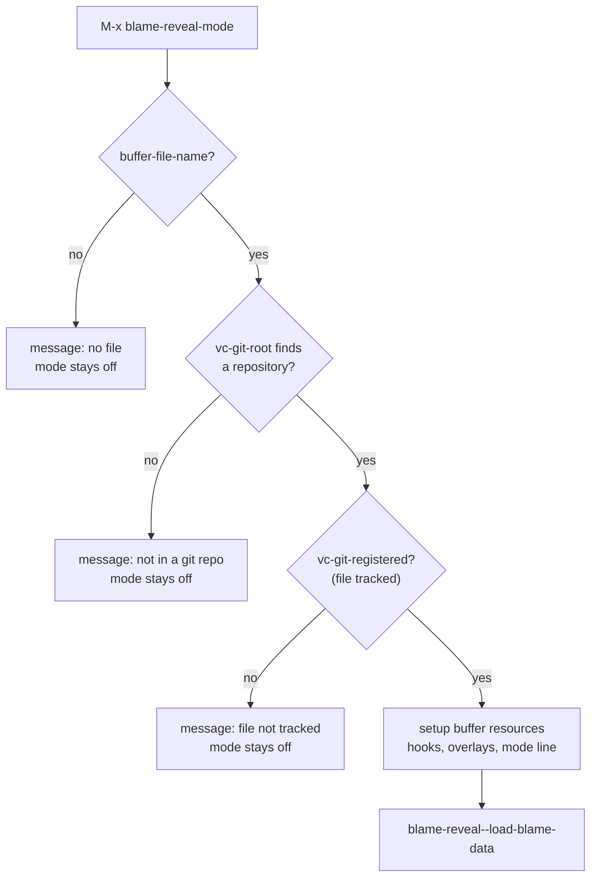

`blame-reveal-global-mode` is a `define-globalized-minor-mode` whose turn-on
function (`blame-reveal--turn-on-mode`) runs the same eligibility test via
`blame-reveal--eligible-buffer-p` — additionally skipping minibuffers and
hidden/special buffers — before enabling the mode per buffer.

---

## 2. Initial blame load — sync vs async, full vs lazy

Two independent decisions are made in `blame-reveal--load-blame-data`
(`blame-reveal-ui.el`) and the loaders in `blame-reveal-git.el`:

1. **Transport** — synchronous `call-process` or asynchronous `make-process`,
   decided by `blame-reveal--should-use-async-p`.
2. **Range** — whole file, or only the visible viewport (lazy), decided by
   `blame-reveal--should-lazy-load-p` (file longer than
   `blame-reveal-lazy-load-threshold`, default 3000 lines).

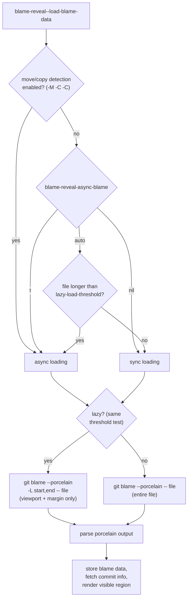

The exact command is assembled by `blame-reveal--build-blame-command-args`:

```
git blame --porcelain [-M -C -C] [-L START,END] [REVISION] -- FILE
```

- `-M -C -C` only when move/copy detection is on.
- `-L START,END` only in lazy mode.
- `REVISION` only when recursively blaming a non-HEAD revision, and never
  when the pseudo-revision is `uncommitted` (working tree).

---

## 3. Async loading — process lifecycle and race protection

Async loading must survive three races: the user killing the buffer, the
user toggling the mode, and a newer request superseding an older one. The
sentinel built by `blame-reveal--make-async-sentinel` re-validates
everything before touching buffer state, using a process ID recorded in the
buffer-local state machine (`blame-reveal--state-verify-process`).

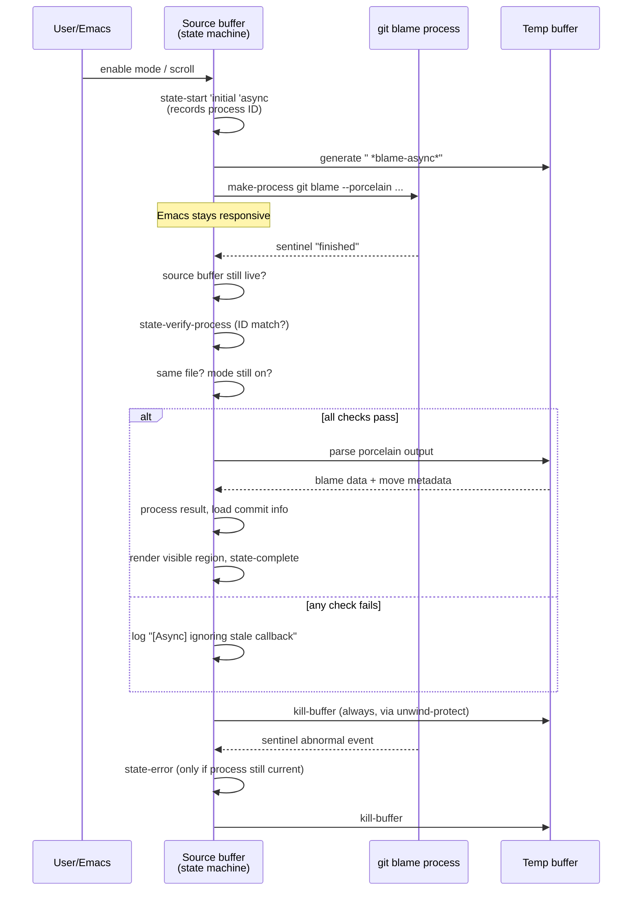

A stale callback — e.g. the user scrolled again and a second blame process
was started — fails the ID check and is discarded without touching state.

---

## 4. Parsing porcelain output

`blame-reveal--parse-blame-output` walks the output line by line. Only
three line shapes matter; everything else is skipped.

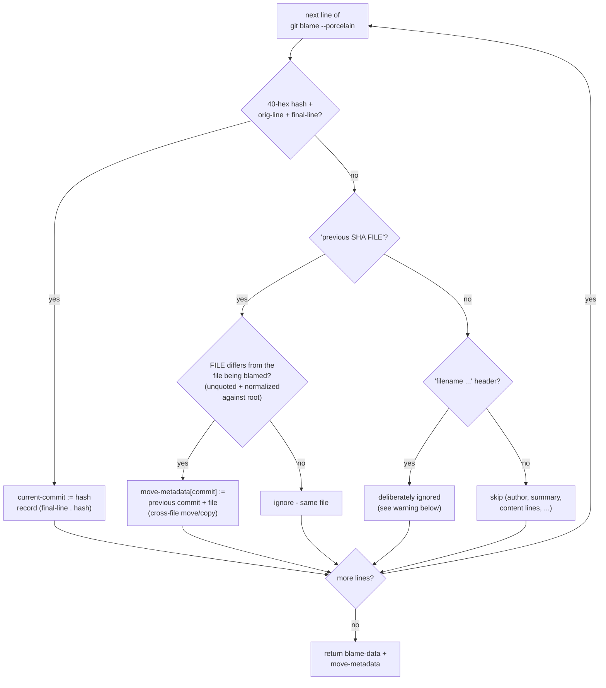

Two parsing rules worth calling out:

- **Quoted paths are unquoted first.** Git C-quotes paths containing
  special or non-ASCII characters (`core.quotePath`); the `previous` path is
  passed through `blame-reveal--unquote-git-path` before the cross-file
  comparison, so e.g. Chinese filenames do not produce spurious
  move/copy metadata.
- **`filename` is not a rename signal.** The porcelain `filename` field
  reports what the file was called when the line was last touched — renames
  in ordinary history change it too. Only the `previous` field reliably
  indicates a cross-file move/copy, and even then only when the recorded
  path differs from the current file after normalization
  (`blame-reveal--is-cross-file-p`).
- **All-zero hash = uncommitted.** Git reports working-tree modifications
  with a hash of forty zeros; `blame-reveal--is-uncommitted-p` matches
  `^0+$` and those lines get the "uncommitted" treatment everywhere else
  (own fringe color, no commit info lookup, blocked from recursive blame).

---

## 5. Commit metadata — one process for N commits

Blame data only yields hashes. Human-readable info is fetched separately
and cached in the buffer-local `blame-reveal--commit-info` hash table.

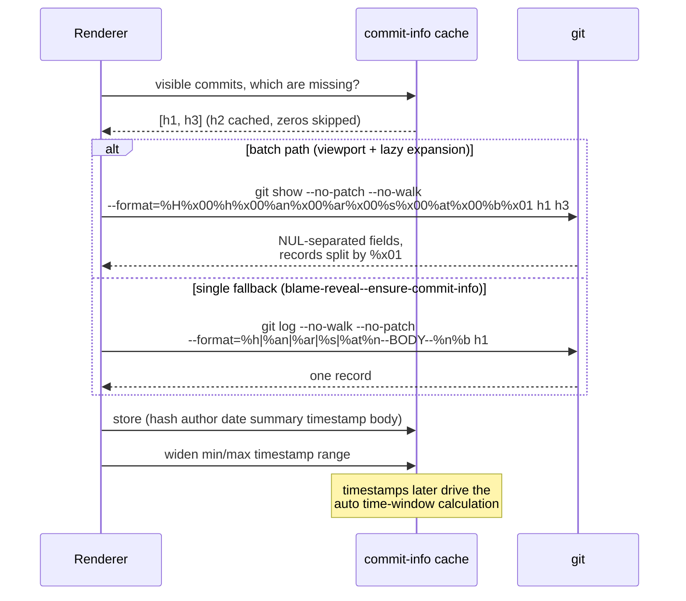

The batch variant (`blame-reveal--get-commits-info-batch`) uses NUL (`%x00`)
field separators and `%x01` record separators, so commit summaries
containing `|` or newlines cannot corrupt parsing. The single-commit
fallback uses `|` separators and would mis-split a summary containing `|` —
one reason the batch path is preferred for anything visible.

---

## 6. Recent-commit selection — the auto time window

Coloring only highlights "recent" commits. With
`blame-reveal-recent-days-limit` set to `'auto`, the window is computed by
`blame-reveal--auto-calculate-days-limit` — **from cached timestamps, with
no extra Git calls**.

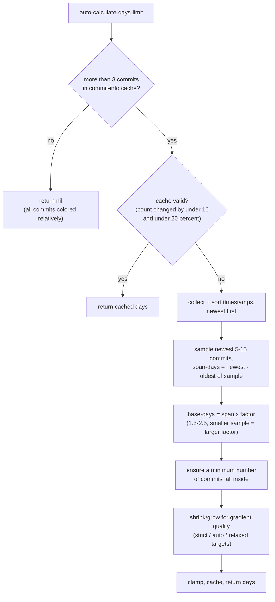

Every commit inside the window gets a gradient color by rank (newest =
brightest); commits outside get the flat "old" color. The cache is
invalidated whenever the loaded commit count changes by more than 10
commits or 20 % — which happens naturally as lazy loading pulls in more
history.

---

## 7. Scrolling a large file — lazy expansion

In lazy mode only the viewport (plus margin) has blame data. Scrolling
into unloaded territory triggers an incremental `git blame -L` for the gap.

```mermaid
sequenceDiagram
    participant W as Window
    participant S as Scroll handler<br/>(debounced)
    participant D as blame-data<br/>(loaded range)
    participant G as git

    W->>S: window-scroll-functions fires
    S->>S: window-start changed? cancel pending timer
    S->>S: idle timer (blame-reveal--scroll-render-delay)
    S->>D: visible range inside loaded range?

    alt already loaded
        D-->>S: yes
        S->>W: render overlays from cache
    else needs expansion
        D-->>S: no
        S->>G: git blame --porcelain -L gapStart,gapEnd -- file<br/>(only the unloaded gap; sync or async,<br/>same rules as initial load)
        G-->>S: porcelain for the gap
        S->>D: merge new (line . hash) entries,<br/>dedupe, re-sort, widen range
        S->>G: batch-fetch info for new commits
        S->>S: recompute recent set (window may shift)
        S->>W: render expanded region + header
    end
```

The expansion request covers only the delta between the loaded range and
the visible range (`blame-reveal--ensure-range-loaded`), so scrolling never
re-blames lines that are already loaded and the loaded range stays
contiguous. Merging is still idempotent on top of that:
`blame-reveal--merge-new-blame-entries-with-commits` hashes the
already-known line numbers and only inserts genuinely new lines, so
overlapping requests cannot duplicate entries. If the state machine is
busy (a load is already in flight), the expansion request is simply
dropped — the next scroll event retries.

---

## 8. Recursive blame — walking into the past

`C-c C-l b` (`blame-reveal-blame-recursively`) re-blames the file as it
existed *before* the commit under point, letting you peel history one layer
at a time. The target is chosen by `blame-reveal--analyze-recursive-target`.

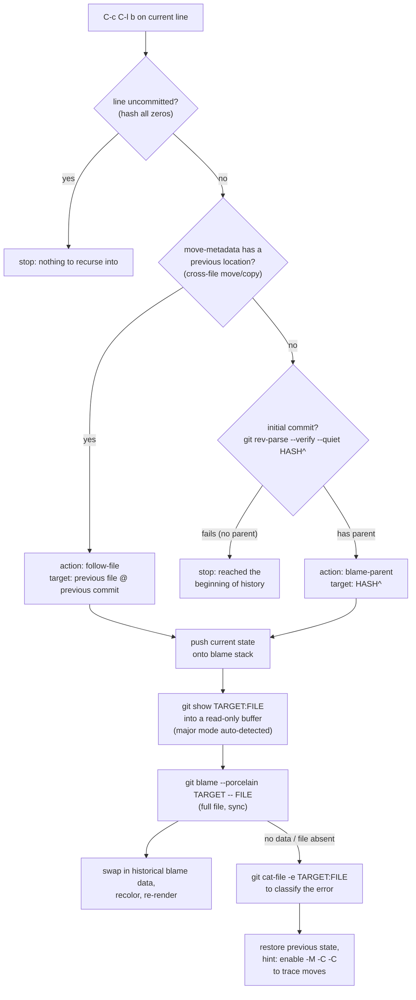

Supporting Git commands in this flow:

| Purpose | Command |
|---|---|
| Does the commit have a parent? | `git rev-parse --verify --quiet HASH^` |
| Does the file exist at that revision? | `git cat-file -e REV:FILE` |
| Short label for prompts | `git show --no-patch --format="%h %s" HASH` |
| Historical file content | `git show REV:FILE` |
| Historical blame | `git blame --porcelain [-M -C -C] REV -- FILE` |

### The blame stack

Every hop pushes the complete display state (revision, blame data, commit
info, point position) onto `blame-reveal--blame-stack`. The **first** hop
away from HEAD also seeds a pristine HEAD snapshot at the bottom, so
"reset" is always a clean single restore.

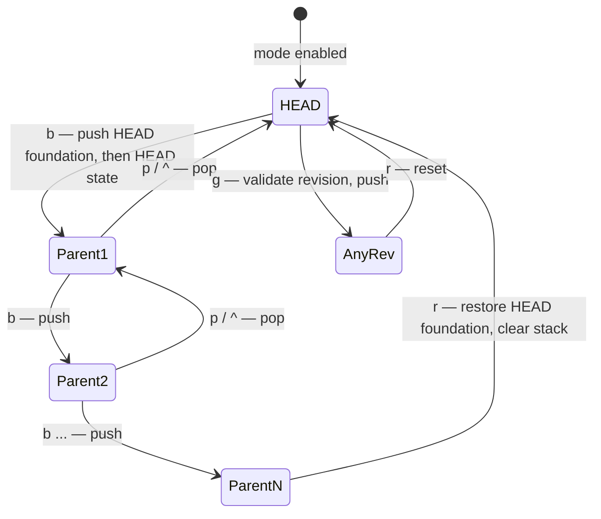

Restores are pure cache swaps — going back never re-runs Git.

---

## 9. Blame at an arbitrary revision

`C-c C-l g` (`blame-reveal-blame-at-revision`) accepts any user-supplied
revision (`HEAD~5`, a tag, a branch, a hash prefix) and validates it before
touching state:

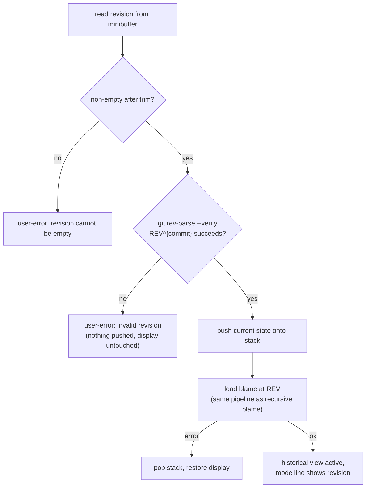

The `^{commit}` suffix makes Git verify the object both exists **and**
resolves to a commit — a tree or blob hash is rejected up front.

---

## 10. Inspecting a commit — diff, details, histories

These commands either delegate to Magit (when installed and
`blame-reveal-use-magit` allows) or run plain Git into a `special-mode`
buffer with a `revert-buffer-function` that re-runs the same command.

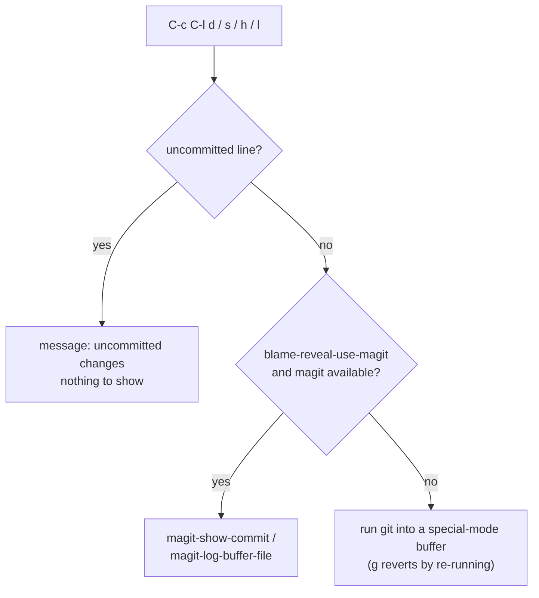

Exact fallback commands:

| Key | Command buffer | Git invocation |
|---|---|---|
| `C-c C-l d` (diff) | `*Commit Diff: HASH*` | `git show --color=never HASH` |
| `C-c C-l s` (details) | popup | cached info + `git show --color=never HASH` |
| `C-c C-l h` (file history) | `*Git Log: FILE*` | `git log --color=always --follow --pretty=format:... -- FILE` |
| `C-c C-l l` (line history) | `*Git Log: FILE:N*` | `git log --color=always -L N,N:FILE` |

The history buffers keep Git's ANSI colors and render them with
`ansi-color-apply-on-region`; the diff buffer requests `--color=never` and
relies on Emacs faces instead. Line history uses `git log -L N,N:FILE`,
which follows the line's content across edits — Git itself does the heavy
lifting of tracking the line through history.

---

## 11. Move/copy detection — the `-M -C -C` switch

Off by default because it is expensive. Toggling it (via the transient
menu) changes three things at once:

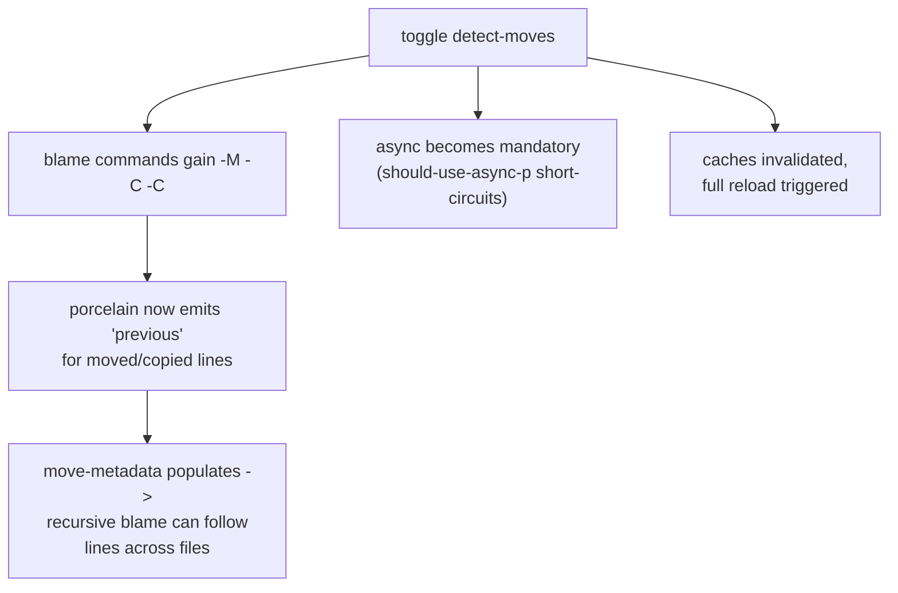

With detection on, `git blame` attributes moved/copied lines to their
*original* commits (`-M` within a file, `-C -C` across files in the same
commit and beyond), and the `previous` metadata gives recursive blame a
cross-file target to follow — the difference between "this line appeared
in the big refactor commit" and "this line is ten years old and moved
here".

---

## Appendix — every Git invocation in one table

| # | Command | Where | Trigger |
|---|---|---|---|
| 1 | `git blame --porcelain [-M -C -C] [-L S,E] [REV] -- FILE` | `blame-reveal-git.el`, `blame-reveal-recursive.el` | initial load, lazy expansion, recursive/at-revision blame |
| 2 | `git log --no-walk --no-patch --format=%h\|%an\|%ar\|%s\|%at... HASH` | `blame-reveal-git.el` | single-commit info fallback |
| 3 | `git show --no-patch --no-walk --format=...%x00...%x01 HASH...` | `blame-reveal-git.el` | batch commit info for the viewport |
| 4 | `git rev-parse --verify --quiet HASH^` | `blame-reveal-recursive.el` | initial-commit test |
| 5 | `git rev-parse --verify REV^{commit}` | `blame-reveal-recursive.el` | user revision validation |
| 6 | `git cat-file -e REV:FILE` | `blame-reveal-recursive.el` | file-exists-at-revision test |
| 7 | `git show REV:FILE` | `blame-reveal-recursive.el` | historical file content buffer |
| 8 | `git show --no-patch --format="%h %s" HASH` | `blame-reveal-recursive.el` | short label for prompts |
| 9 | `git show --color=never HASH` | `blame-reveal.el` | commit diff / details buffer |
| 10 | `git log --color=always --follow --pretty=... -- FILE` | `blame-reveal.el` | file history buffer |
| 11 | `git log --color=always -L N,N:FILE` | `blame-reveal.el` | line history buffer |
| 12 | `vc-git-root` / `vc-git-registered` (via vc) | `blame-reveal.el` | eligibility checks |
